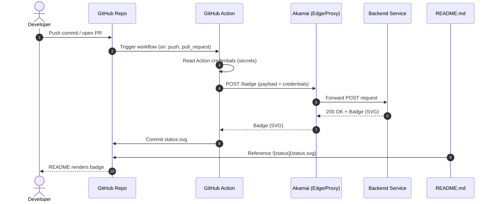

# badge-action-sample

```mermaid
sequenceDiagram
    autonumber
    actor Dev as Developer
    participant Repo as GitHub Repo
    participant GHA as GitHub Action
    participant Akamai as Akamai (Edge/Proxy)
    participant Backend as Backend Service
    participant Readme as README.md

    Dev->>Repo: Push commit / open PR
    Repo->>GHA: Trigger workflow (on: push, pull_request)
    GHA->>GHA: Read Action credentials (secrets)
    GHA->>Akamai: POST /badge (payload + credentials)
    Akamai->>Backend: Forward POST request
    Backend-->>Akamai: 200 OK + Badge (SVG)
    Akamai-->>GHA: Badge (SVG)
    GHA->>Repo: Commit status.svg
    Readme->>Repo: Reference ![status](status.svg)
    Repo-->>Dev: README renders badge
```
