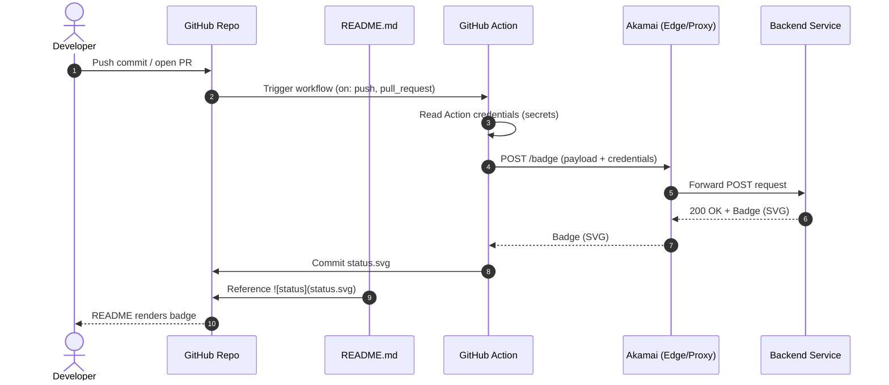

# badge-action-sample

---

Any commit to the Repo triggers the workflow below, it requests and saves a `badge.svg` file, which this README.md file references.
>Note: See the [badges.yml](.github/workflows/badges.yml) workflow for details.

